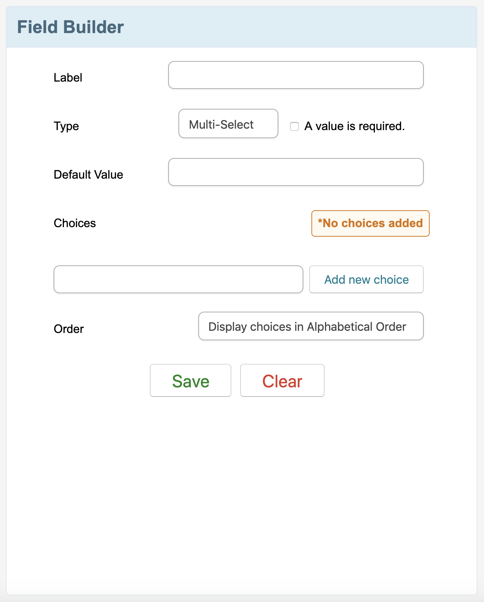

# Multiple Choice Editor using React
About the requirement: https://github.com/QuickBase/interview-demos/tree/master/ui 

## Live Demo
https://narains.github.io/craft-demo
   

## Available Scripts

In the project directory, you can run:

### `npm start` or `yarn start`

Runs the app in the development mode. 
Open [http://localhost:3000](http://localhost:3000) to view it in the browser.

The page will reload if you make edits. 
You will also see any lint errors in the console.

## UI for Multiple Choice Editor

